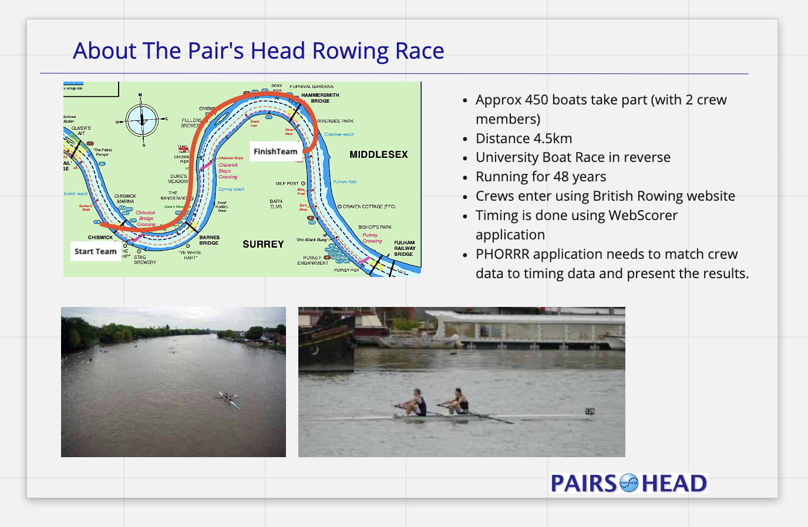
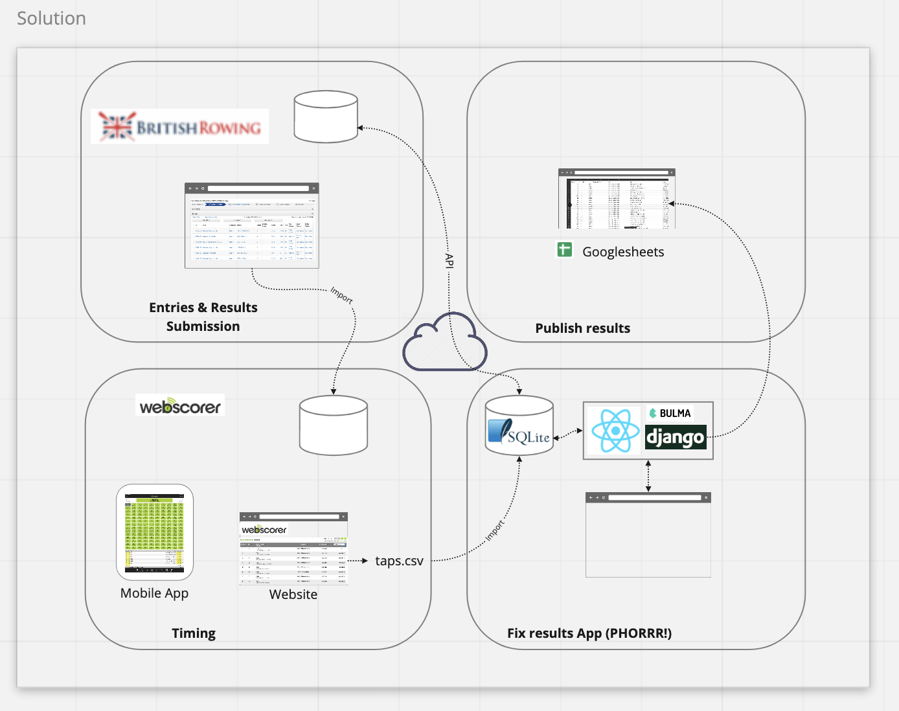
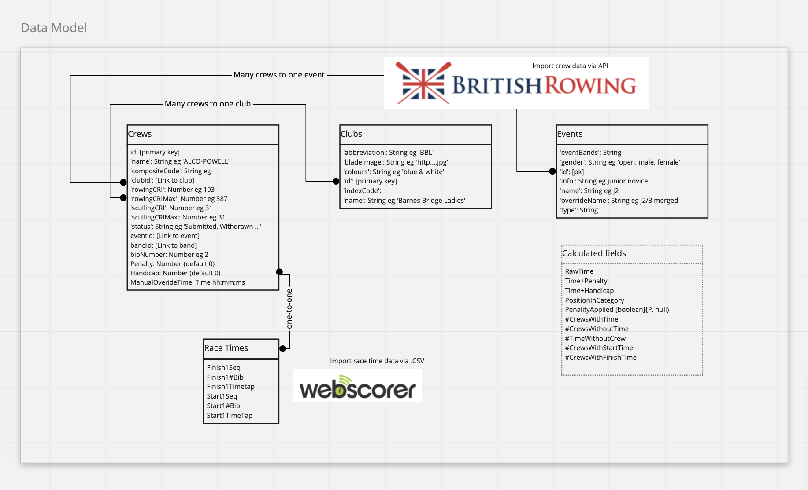
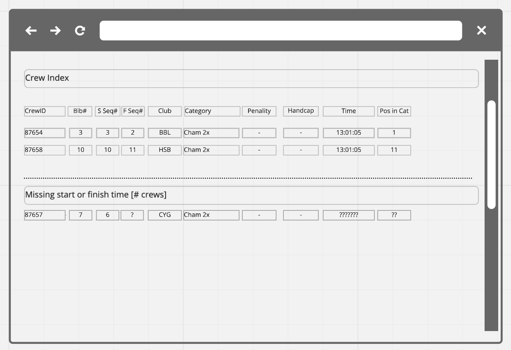
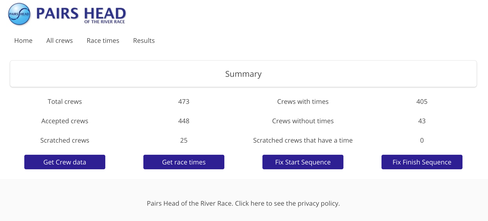
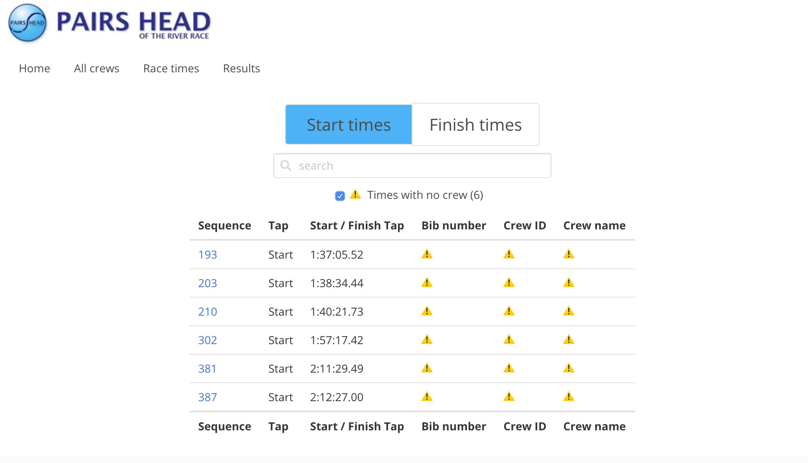
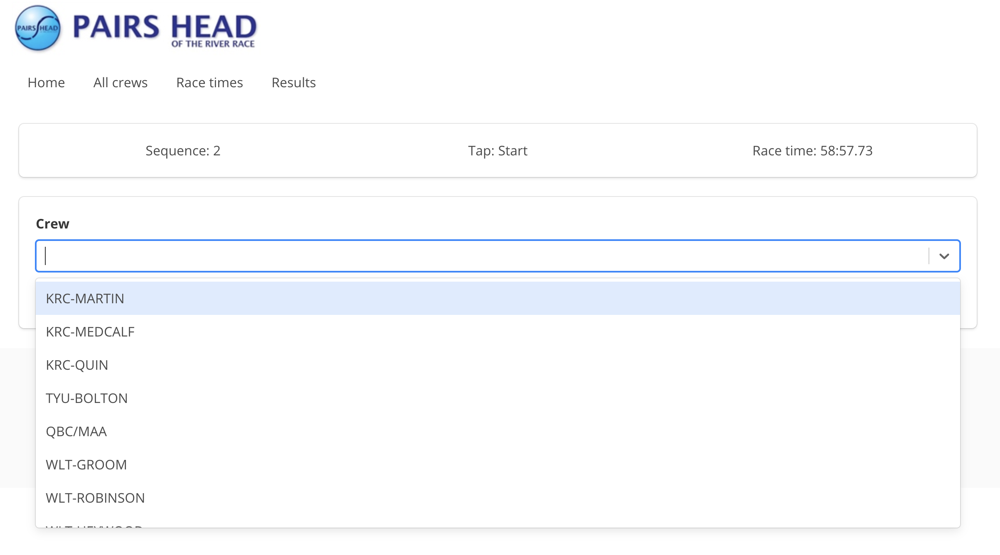
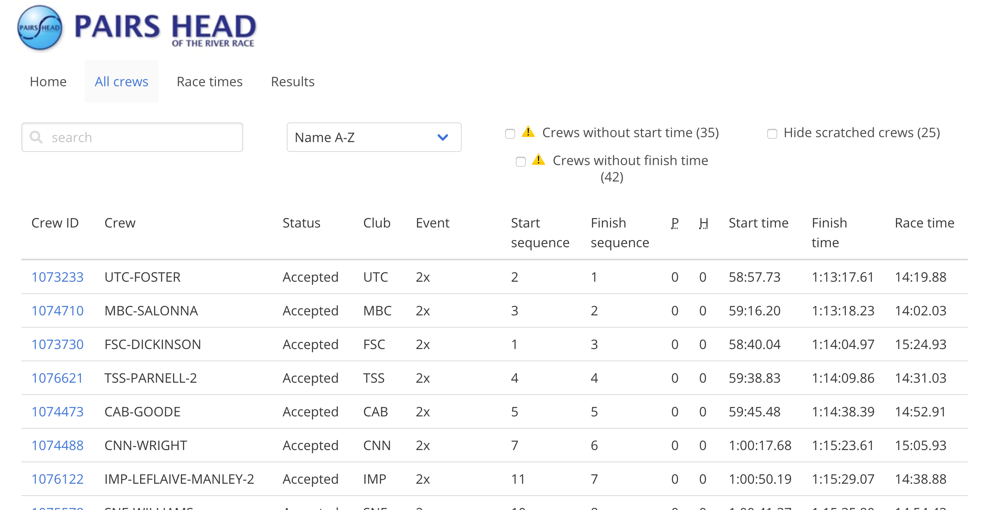
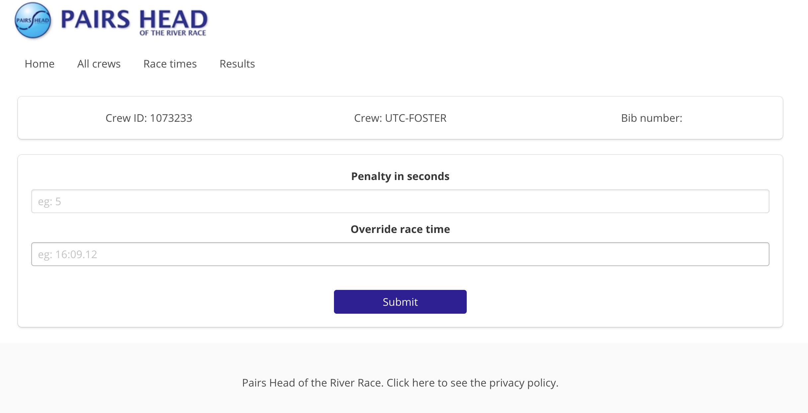

# **Project 4: Pairs Head of the River Rowing Race Results**

## Overview

Launch on [Heroku](https://pairshead.herokuapp.com/#/).


The application’s purpose is to generate results for the Pair’s Head Rowing Race which takes place annually.



As a volunteer for Barnes Bridge Ladies Rowing club who run this race, I help the race organizer to produce the results each year using Excel.  I am hoping that this application will replace the Excel and make the process much simpler.

The website consumes data about crews from an API supported by the British Rowing website.  It also reads race times from .csv files exported from an application called WebScorer. The goal of the application is to pull together the crew data from British rowing and match up to the timing data from Webscorer and to produce a set of results that will be published to GoogleSheets (since all 800+ rowers are keen to access it as soon as the results go up.)



This project has been built as part of a learning module in General Assembly's Software Engineering Immersive Course using JavaScript, Python, Django and React.

It has been solely developed by Sian Alcock.

### Project duration
7 days.

### Installation
* Clone or download the repo
* Run yarn and pipenv install in the CLI to install dependencies
* Run yarn serve:backend to run backend
* Run yarn serve:frontend to run front-end

## Brief

The project brief is as follows:

* **Build a full-stack application** by making your own backend and your own front-end
* **Use a Python Django API** using Django REST Framework to serve your data from a Postgres database
* **Consume your API with a separate front-end** built with React
* **Be a complete product** which most likely means multiple relationships and CRUD functionality for at least a couple of models
* **Implement thoughtful user stories/wireframes** that are significant enough to help you know which features are core MVP and which you can cut
* **Have a visually impressive design** to kick your portfolio up a notch and have something to wow future clients & employers. **ALLOW** time for this.
* **Be deployed online** so it's publicly accessible.
* **Have automated tests** for _at least_ one RESTful resource on the back-end. Improve your employability by demonstrating a good understanding of testing principals.

## Technologies Used

* HTML5
* CSS3
* JavaScript (ES6)
* React
* Webpack
* Python
* Django
* Django REST Framework
* PostgreSQL
* HashRouter, Route, Switch, Link  from React Router DOM
* React Select
* JSON Web Token
* Axios
* Python Dotenv
* SCSS, Bulma
* Git, GitHub
* Lodash
* Google Fonts, FortAwesome
* Moment, Moment-duration-format

## Approach Taken

I started by designing the data models.



I used a product called Miro to create the above datamodel, some wireframes and I used the Miro Kanban to keep track of tasks.  The advantage of using Miro was that everything was all in one place.
Below is an example wireframe for the Crew index page.



My first task was to get the crew data from British Rowing and from the timing data from WebScorer.  British rowing have a fully supported API which is well documented.  After signing up for an accounting and getting completing a terms of use form, I was given a set of keys.  I was quickly able to establish a connection to the three desired end points, namely Clubs, Events and Crews.

Getting the WebScorer data was more difficult.  WebScorer does have an API but it is not documented.  The WebScorer application does enable download to .csv file.  So I researched how to read in data from a .csv file.  This was done by creating a serializer and a view to read in the data and save it to the database.

The above two tasks were very challenging and took me 3 days which was longer than I had hoped.  I took the decision that I would not build the automated tests set out in the brief but instead to start building the front end.

There are many features still to build in order for the application to meet all the requirements needed to make it usable for the actual race results.  As a result, I have cloned the repository and am continuing building the application in a separate repository on GitHub called 'Pairshead-results' (https://github.com/sian-alcock/pairshead-results)

## Functionality

### Landing page
The landing page/Home page includes the following features:
* Summary metrics eg number of crews without times
* Button to refresh Crew data from British rowing
* Button to refresh timing data from WebScorer .csv file
* Buttons to access the start and finish sequences



The data from British rowing API comes from three end points.  Each crew has an associated rowing club and competing in a specific event (eg senior scullers, junior pairs etc).  I use async / await to ensure that the club and event data was completed before calling the crew data.  The import takes around 8 seconds so I presented a spinner icon in the body of the button to help manage the user experience.  I'm really proud of this code which took me around a day to research and implement.  The code is run from a component called 'ImportCrewData'.  The async/await function is set out below:

```JavaScript
async getData() {

  this.setState({ loading: true })

  try {

    const clubsPromise = axios.get('/api/club-data-import/')
    const eventsPromise = axios.get('/api/event-data-import/')
    const [clubs, events] = await Promise.all([clubsPromise, eventsPromise])
    console.log(clubs.data, events.data)

    // wait for first two calls before running the crew import
    const crews = await axios.get('/api/crew-data-import/')
    console.log(crews.data)

    this.setState({ crewDataUpdated: Date.now(), loading: false })

  } catch (e) {
    console.error(e)
  }
}
```

I used a similar approach for the button to import the race time data from the .csv file.

### Race time index page
When the race is over and the result assembly process begins, the first task that must be completed after importing the latest crew and race time data, is to make sure the start sequence and finish sequence is correct.

This task can be managed from the race time index page.



Times that do not have a crew should be assigned to a crew and times that have been incorrectly allocated to a crew must be reassigned to the correct crew.  Note:  At the start and finish times, there are at least 3 people writing down which boat number crosses the start or finish line in which sequence.  Failing that, there is a video recorder at the start / finish which can also be checked to ensure the sequence is correct.

Key features on this page include:
* tabs to switch between Start and Finish times
* search field
* tick box to filter to those times that have no crews
* list of race times along with associated crew ID and crew name
* id of each time is a link which when clicked presents the race time edit page.

### Race time edit page
On this page, if a time has no crew or an incorrect crew, an alternative crew can be selected.  The pull-down is a 'React Select' component which enables the user to start typing which helps to quickly find the crew (amongst the 400+ data set).



### Crew index page
This page shows lists all the crews and related data.  It includes:
* search field
* sort options in a pull-down
* filters for crews without start and finish times
* filter to show 'scratched' crews (they are filtered out by default)



### Edit page
This page allows the user to assign a penalty to a crew.  Note:  Penalties are given to crews who block other crews during the race or who are late or otherwise badly behaved.  If needed an override time can be entered.  This is entered as an overall race time in the case where the race organizer has had to use the video footage to get the time for a specific crew.



### Results
Finally, the results are listed ordered by the crew with the fastest time.  


### Code not specific to a page
* Navbar
* Footer
* Calculated times

## Time storing and calculation

At the planning stage, I spent quite a bit of time researching how to handle the time calculations.  Times are presented to hundredths of seconds in the results and I was aware that dealing with time data can be complicated.  I therefore decided that I would store the times in miliseconds and use a package called Moment.js and a formatting plugin to present the times in the correct format on the front end.  When importing the race time data from the WebScorer .csv files, I created the following serializer to read in the data from the .csv that included a function to convert the times into miliseconds.

```Python
class WriteRaceTimesSerializer(serializers.ModelSerializer):

    time_tap = serializers.CharField(max_length=20)

    class Meta:
        model = RaceTime
        fields = ('id', 'sequence', 'bib_number', 'tap', 'time_tap', 'crew',)

    def validate_time_tap(self, value):
        # if time tap format is mm:ss.ms (eg 58:13.04), then add 0: at front
        if re.match(r'^[0-9]{2}:[0-9]{2}.[0-9]{2}', value):
            value = f'0:{value}'

        if not re.match(r'^[0-9]:[0-9]{2}:[0-9]{2}.[0-9]{2}', value):
            raise serializers.ValidationError({'time_tap': 'Problem with time tap format'})

        hrs, mins, secs = value.split(':')
        secs, hdths = secs.split('.')
        # convert to miliseconds
        value = int(hrs)*60*60*1000 + int(mins)*60*1000 + int(secs)*1000 + int(hdths)*10

        return value
```  

### Bugs

* On the race-time edit page, if you select a crew that already has a start or finish time, there is an error.  Ideally, the selection would replace any existing link and make the former time be orphaned.
* The API includes images of each clubs blades.  In some cases, the links are broken as no image exists. I intended to present a default image in such cases but ran out of time.
* The manual override time on the crew edit page needs to have an input mask so that the time can be entered in race format (ie h:mm:ss:SS).  Currently it only accepts a number (which is miliseconds).
* On the Landing page, once the data imports have been run a date/time update is presented but since it is not stored, it is lost once the user navigates away from the page.  Ideally, this would be stored.

## Wins and Blockers

### Win: Data import

I learned a great deal about working with data from APIs and reading in data from .csv files.  This also helped me to better understand how to work with Django views and serializers.

### Win: Promises and Async / Await

My other great challenge was to get the data coming in at the click of a button but in a managed way.  I have described this function in a section above.

### Blocker: Pagination

I am troubled by the fact that the pages are a little slow - in particular on the Heroku deployment site.  I ran out of time, but it is my intention to employ paging on all the list pages.  I hope this will improve the response times.

### Blocker: Broken images

I wanted to replace broken blade images on the Results page with a default image.  I downloaded a package called React Image which purports to replace broken image links with default images.  However, I failed to get it working in the time and removed the code from this project.

### Blocker: Automated tests not completed

The project brief did require automated tests.  I attempted a test for the crew index route but failed to get it working.  Given that I was quite far behind, I agreed with my instructor that I should move on to the front end and come back to it.  I intend to get the crew routes fully tested at a later date.

## Future Content

I would like to include the following capabilities:
* tables that support in-line editing
* pagination to improve page responsiveness
* export to .csv file (as this is required in the real world)
* a user model - only really required for race organizers but I would like to get it working.

## What I learned

Major learning points:
* coding a fullstack application from scratch takes time!
* how to import data from an API and storing it in a database
* how to read data from .csv files and storing it in a database
* how to manage time fields
* how to manage three different API requests in a single function using promises and Async/await
* if you get the data model wrong initially, that can cause problems so make sure you do the planning ahead of time.
